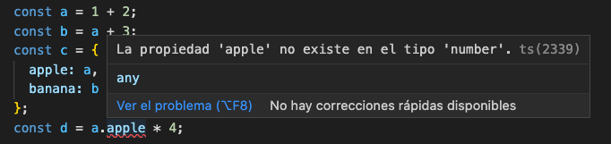

## PEC3 - Ejercicio2

### **Fichero code1.ts**
En este código, vemos como para calcular la constante d, tecleamos la línea _a.apple_. El compilador sabe que _a_ es de tipo numérico, no es ningun objeto, y no tiene ninguna propiedad llamada apple. 




### **Fichero code2.ts**
1. ¿Qué tipos de datos se infieren?
- a: numero. 
- b: cadena. 
- c: cadena.
- d: array de booleanos.
- e: objeto con una propiedad de tipo cadena
- f: array con elementos de tipo numérico o booleanos. Al ver que son los dos tipos de los elementos insertados en el array, decide que eso son los tipos.
- g: array de números
- h: tipo null 


### **Fichero code3.ts**

2. ¿Porqué se disparan cada uno de estos errores?

```typescript
i = 4; // Error TS2588 : Cannot assign to 'i' because it is a constant.ts(2588)
```
El valor _i_ es de tipo constante y no puede cambiar su valor.


```typescript
j.push('5'); // Error TS2345: Argument of type '"5"' is not assignable to parameter of type 'number'.
```
El array _j_ es de tipo numérico y no podemos añadirle una cadena.

```typescript
let k: never = 4; // Error TSTS2322: Type '4' is not assignable to type 'never'.
```
El tipo never es especial y no podemos asignarle ningún otro tipo excepto otro never.


```typescript
let m = l * 2; // Error TS2571: Object is of type 'unknown'.
```
Unknown es un tipo asignable a cualquier valor, pero no podemos hacer operaciones con dicho tipo. Se hace para obligar al programador a comprobar tipos y hacer converisones de tipos antes de realizar operaciones.

### **Clases vs Interfaces**
3. Diferencia entre una clase y una interface en TypeScript
Una interfaz solo declara tipos y métodos, no programando estos últimos ni inicializando valores algunos. Se usa a modo de contrato para indicar lo que un objeto o clase debe contener estrictamente a modo de comprobación de tipos.

